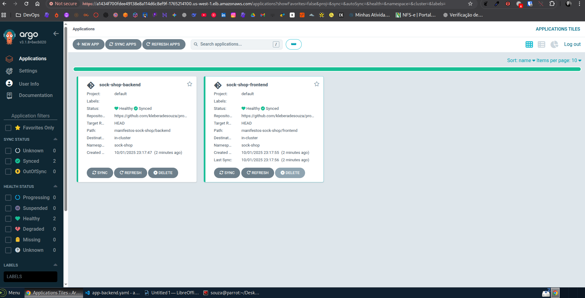
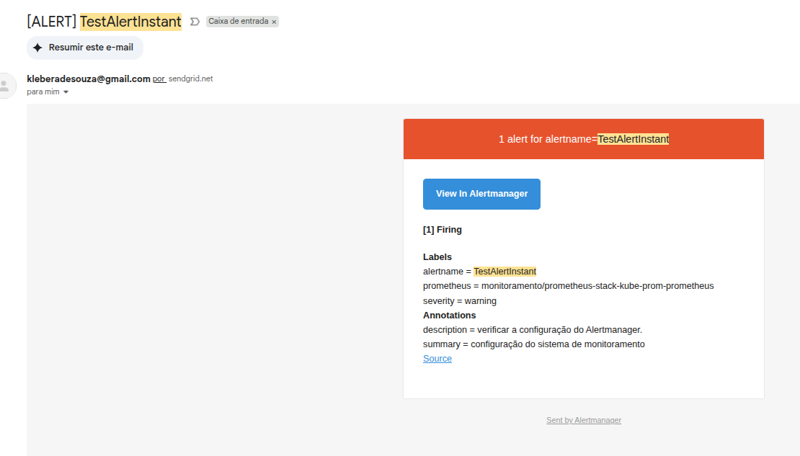
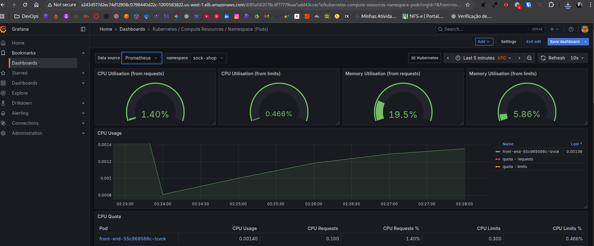

# Projeto Técnico DevOps Infraestrutura na AWS com EKS, GitOps e Observabilidade

> Este projeto demonstra a criação de uma infraestrutura Kubernetes completa na AWS, com provisionamento automatizado, monitoramento e deployment contínuo via GitOps.

  <a href="#sobre-o-projeto">Sobre</a> •
  <a href="#arquitetura">Arquitetura</a> •
  <a href="#stack-de-tecnologias">Tecnologias</a> •
  <a href="#como-executar">Como Executar</a> •
  <a href="#resultados">Resultados</a> •
  <a href="#autor">Autor</a>

## Stack de Tecnologias

  
  
  
  
   
  
  
  
  

Aqui estão as etapas para reproduzir este ambiente.

### Etapa 1: Provisionamento da Infraestrutura via Terraform e CI/CD
Nesta fase, preparei o backend na AWS e usei o Terraform, automatizado por uma pipeline no GitHub Actions, para criar toda a infraestrutura.

# 2.1. Preparação do Backend na AWS
Primeiro, criei os recursos na AWS para armazenar o estado do Terraform de forma
remota e segura.

# Criar o bucket S3 para o arquivo de estado
aws s3api create-bucket --bucket seu-bucket-de-exemplo --region us-west-1

# Criar a tabela DynamoDB para o lock de estado
aws dynamodb create-table \
    --table-name sua-tabela-lock-de-exemplo \
    --attribute-definitions AttributeName=LockID,AttributeType=S \
    --key-schema AttributeName=LockID,KeyType=HASH \
    --provisioned-throughput ReadCapacityUnits=5,WriteCapacityUnits=5 \
    --region us-west-1

# 2.2. Automação com GitHub Actions
Configurei os segredos AWS_ACCESS_KEY_ID e AWS_SECRET_ACCESS_KEY no repositório do GitHub. A pipeline definida em .github/workflows/terraform.yaml foi responsável por executar automaticamente o terraform apply a cada push na branch main.

# Acionamento da pipeline
git add .
git commit -m "Adiciona arquivos de infraestrutura e pipeline"
git push origin main

# 2.3. Conexão ao Cluster EKS
Após a conclusão da pipeline, que levou alguns minutos, e conectei cluster.

# Comando para configurar o kubeconfig
aws eks --region us-west-1 update-kubeconfig --name seu-cluster-de-exemplo

# Verificar a conexão listando os nós
kubectl get nodes

### Etapa 2: Implementação da Stack de Monitoramento
Com o cluster no ar, implementei a stack Kube-Prometheus-Stack usando Helm para ter
observabilidade.

# 1. Criar o namespace para monitoramento
kubectl create namespace monitoramento

# 2. Criar o segredo com a chave da API do SendGrid para os alertas
kubectl create secret generic alertmanager-smtp-password \
--from-literal=password='SUA_CHAVE_API_DO_SENDGRID' \
-n monitoramento

# 3. Adicionar o repositório do Helm e instalar a stack
# 1. Criar o namespace para monitoramento
kubectl create namespace monitoramento

# 2. Criar o segredo com a chave da API do SendGrid para os alertas
kubectl create secret generic alertmanager-smtp-password \
  --from-literal=password='SUA_CHAVE_API_DO_SENDGRID' \
  -n monitoramento

# 3. Adicionar o repositório do Helm e instalar a stack
helm repo add prometheus-community https://prometheus-community.github.io/helm-charts

helm repo update
helm install prometheus-stack prometheus-community/kube-prometheus-stack \
  --namespace monitoramento \
  -f monitoramento/values.yaml

# 3.2. Teste de Alertas
Para validar a integração do Alertmanager com o SendGrid, apliquei uma regra de alerta
que dispara imediatamente.

kubectl apply -f monitoramento/test-alert.yaml -n monitoramento
Após alguns minutos, recebi um e-mail, confirmando que a pipeline de alertas estava
funcionando.

# 3.3. Acesso ao Grafana
Para visualizar os dashboards, expus o Grafana com um Load Balancer.
Bash

# Alterar o tipo de serviço para LoadBalancer
kubectl patch svc prometheus-stack-grafana -n monitoramento -p '{"spec": {"

# Obter a URL de acesso
kubectl get svc -n monitoramento prometheus-stack-grafana

# Obter a senha de admin
kubectl get secret -n monitoramento prometheus-stack-grafana -o jsonpath="{

### Etapa 3: Implementação de GitOps com Argo CD
A etapa final foi automatizar o deploy da aplicação Sock Shop, substituindo o processo
manual por um fluxo de GitOps gerenciado pelo Argo CD.

# 4.1. Preparação do Repositório Git
Dividi os manifestos da aplicação Sock Shop em duas partes, conforme a exigência:
1. Backend: Criei a pasta manifestos-sock-shop/backend e salvei nela todos os
YAMLs dos serviços, exceto o do frontend.
2. Frontend: Criei a pasta manifestos-sock-shop/frontend e salvei nela apenas os
manifestos de Service e Deployment do frontend.

# 4.2. Instalação e Configuração do Argo CD
kubectl create namespace argocd

kubectl apply -n argocd -f https://raw.githubusercontent.com/argoproj/argo-cd/stable/manifests/install.yaml

# 2. Expor a interface e obter a senha para acesso
kubectl patch svc argocd-server -n argocd -p '{"spec": {"type": "LoadBalancer"}}'
kubectl -n argocd get secret argocd-initial-admin-secret -o jsonpath="{.data.password}" | base64 -d

# 2. Expor a interface e obter a senha para acesso
kubectl patch svc argocd-server -n argocd -p '{"spec": {"type": "LoadBalanc

kubectl -n argocd get secret argocd-initial-admin-secret -o jsonpath="{.dat

# 4.3. Criação das Aplicações no Argo CD
Após acessar a interface, criei duas “Aplicações” no Argo CD, uma para cada parte da
Sock Shop, apontando para as respectivas pastas no meu repositório GitHub. Isso foi
feito aplicando dois manifestos ( app-frontend.yaml e app-backend.yaml ).

O Argo CD automaticamente detectou os arquivos, criou o namespace sock-shop e
sincronizou todos os recursos, fazendo o deploy completo da aplicação de forma
automatizada.

Repositório Oficial da Aplicação: [microservices-demo/microservices-demo](https://github.com/microservices-demo/microservices-demo)

___________________________________________________________________________________________________________________________________

**Argo CD gerenciando o deploy da aplicação Sock Shop:**

**Alertmanager Email:**

**Dashboards de monitoramento do cluster no Grafana:**

## Autor

**`Kleber Souza`**

* LinkedIn: `https://linkedin.com/in/souzaklebersc`
* GitHub: `https://github.com/kleberadesouza`